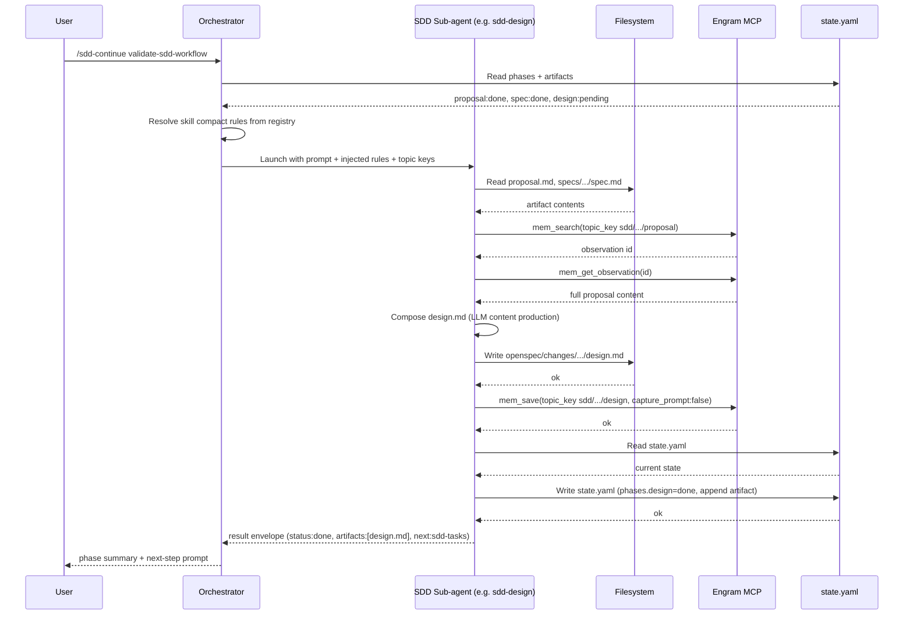
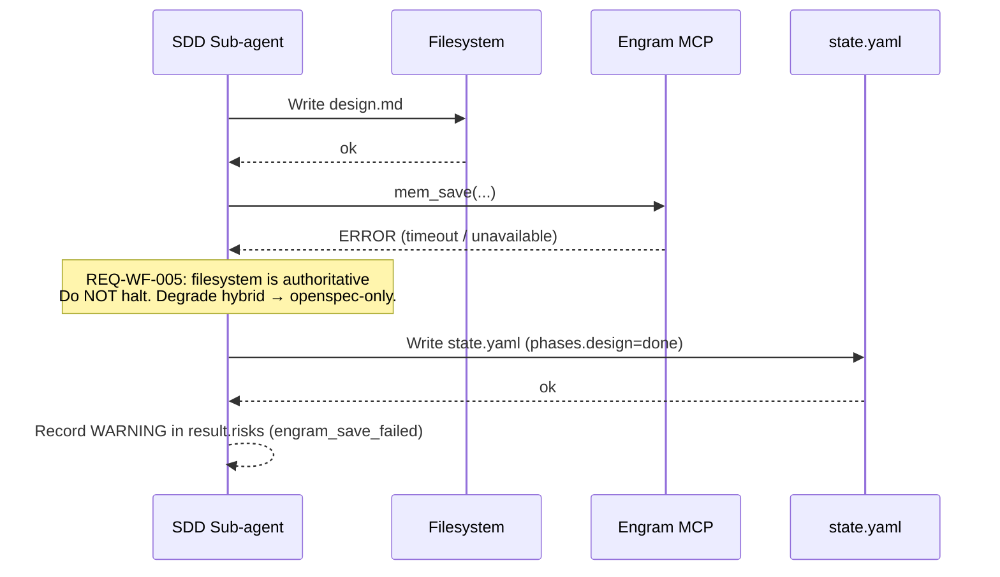
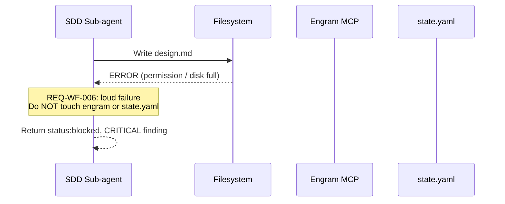

# Design — validate-sdd-workflow

**Change**: `validate-sdd-workflow`
**Domain**: `departamento-core`
**Phase**: design
**Date**: 2026-05-14
**Artifact store**: hybrid (engram + filesystem)

---

## Architecture Overview

The SDD workflow is a **deterministic orchestration layer** (Python — Claude Code dispatcher + Engram MCP) wrapping **non-deterministic content producers** (LLM-driven skills `sdd-propose`, `sdd-spec`, `sdd-design`, `sdd-tasks`, `sdd-verify`). The orchestrator owns the DAG, persistence, and verification gates; the LLM owns content production only. This is the **1st principle** materialized: *Python traza el camino → IA lo recorre → Python verifica*.

For this meta-validation change, the same architecture is *both* the system under test and the test harness. We are exercising the workflow on the workflow itself (7th principle: meta-producto recursivo).

### Actors and components

| Actor | Type | Responsibility |
|-------|------|----------------|
| **Orchestrator** (Claude Code main thread) | Deterministic | Reads DAG state, decides next phase, launches sub-agents with pre-resolved skills, synthesizes results |
| **SDD sub-agents** (`sdd-propose`, `sdd-spec`, `sdd-design`, `sdd-tasks`, `sdd-verify`) | LLM-driven, single-purpose | Each reads required inputs, produces ONE artifact, persists it, returns a result envelope |
| **Filesystem** (`openspec/changes/{change}/`) | Deterministic store | Authoritative artifact store. Authoritative `state.yaml` lives here |
| **Engram MCP** (`mem_save`, `mem_search`, `mem_get_observation`) | Deterministic store | Redundant persistence; survives compaction; topic-key upsert |
| **`state.yaml`** | Deterministic DAG state | Source of truth for phase status and artifact registry. Survives session loss |
| **`openspec/config.yaml > rules.{phase}`** | Preventive contract | Per-phase rule list enforced by each sub-agent at write time |

### Data flow (one phase)

1. Orchestrator reads `state.yaml`, decides next ready phase.
2. Orchestrator resolves skill compact rules from registry, injects into sub-agent prompt.
3. Sub-agent (LLM context) reads required upstream artifacts via filesystem (canonical paths) and engram (topic keys).
4. Sub-agent produces content, writes to canonical filesystem path FIRST.
5. Sub-agent persists to engram via `mem_save` with stable `topic_key`, `capture_prompt: false`.
6. Sub-agent updates `state.yaml`: read → modify → write (set `phases.{phase}: done`, append `artifacts` entry).
7. Sub-agent returns result envelope (`status`, `executive_summary`, `artifacts`, `next_recommended`, `risks`, `skill_resolution`).
8. Orchestrator decides whether to continue (auto mode) or pause (interactive mode).

**Write order is non-negotiable**: filesystem → engram → state.yaml. This guarantees that if any single step fails, the upstream stores remain consistent and the downstream stores can be reconciled deterministically (see Auto-Fix Candidates §).

---

## Sequence Diagrams

### Happy path — single phase execution (>5 steps, >3 actors → diagram required by `rules.design`)

### Failure path — Engram unavailable (matches SCN-02)

### Failure path — Filesystem write fails (matches EC-04)

---

## Architecture Decisions (ADRs)

### ADR-D1 — `artifact_store: hybrid` (engram + filesystem) instead of pure engram or pure openspec

**Context**: The SDD workflow supports four artifact-store modes: `engram`, `openspec`, `hybrid`, `none`. For this meta-validation change we need a mode that:
1. Exercises both persistence layers (so we actually validate the dual contract, not half of it).
2. Is recoverable if either layer fails individually.
3. Produces committable evidence — required because we want a git audit trail of *what SDD looks like when it runs correctly* for future reference.

**Decision**: `hybrid`.

**Rationale**:
- **Pure engram** would skip the filesystem path. Since the SDD workflow's canonical paths are part of the contract under test (REQ-WF-001), skipping them would defeat the validation.
- **Pure openspec** would skip engram. Since engram persistence is also part of the contract (REQ-WF-004) and is mandatory for cross-session survival under Departamento policy, skipping it would also defeat the validation.
- **`none`** is a non-starter — no persistence means no audit trail.
- **Hybrid** is the only mode that exercises both stores and lets us verify that they remain consistent (INV-01 — `state.yaml` is canonical, engram is redundant).

**Rejected alternatives**:
- Engram-only with later filesystem export script → adds complexity, breaks the convention that filesystem IS the canonical store.
- Filesystem-only with manual engram replication → defeats the point of automated dual persistence.

**Tradeoff accepted**: hybrid mode uses more tokens per phase (two writes per artifact), but tokens are cheap compared to losing structural validation coverage.

### ADR-D2 — `sdd-apply` and `sdd-archive` are skipped for this change

**Context**: The standard SDD DAG is `proposal → {spec, design} → tasks → apply → verify → archive`. This change explicitly skips `apply` and `archive`.

**Decision**: Hard-code `apply: skipped` and `archive: skipped` in `state.yaml`. `sdd-verify` MUST treat their absence as expected, not as a violation (INV-04).

**Rationale**:
- This is a **meta-validation** of the *mechanics* of the workflow, not a real feature. There is no production code to write (`apply` would have nothing to do).
- Archive mergea specs into `openspec/specs/{domain}/spec.md`. The spec under test here is itself a contract about the workflow — merging it to the canonical departamento-core spec would conflate the test fixture with the production contract. That's a category error.
- Skipping `apply` and `archive` keeps rollback trivial: `rm -rf openspec/changes/validate-sdd-workflow/` returns the working tree to pristine state with one command (see Reversibility Matrix §).

**Rejected alternatives**:
- Run `apply` with a no-op task list → introduces noise and doesn't validate anything new.
- Run `archive` to test the merge step → permanently contaminates `openspec/specs/departamento-core/` with workflow-about-workflow content. Not reversible without manual surgery.

**Tradeoff accepted**: we don't validate `apply` and `archive` in this change. They will be validated separately when a real feature change runs through the workflow (Sprint 2+).

### ADR-D3 — `spec` and `design` ran sequentially, not in parallel

**Context**: REQ-WF-007 explicitly states `spec` and `design` MAY run in parallel (no dependency between them — both depend only on `proposal`). The DAG permits parallelism.

**Decision**: For this validation run, `spec` and `design` execute **sequentially** (spec first, then design — as visible in `state.yaml` timeline).

**Rationale**:
- **Single-threaded validator**: this is a meta-validation. We are *validating the workflow*, which includes validating that sequential execution works. Running in parallel would couple two unknowns and make root-cause analysis harder if anything failed.
- **`state.yaml` race conditions** (EC-05) are an open structural question. Parallel execution would attempt simultaneous read-modify-write on `state.yaml`. The convention currently has no file-locking protocol. Until that protocol is designed and validated, sequential is safer.
- **Token economy**: parallel sub-agents would double engram MCP traffic without meaningfully reducing wall-clock time in interactive mode.

**Rejected alternatives**:
- Parallel `spec` + `design` with optimistic merge on `state.yaml` → would surface EC-05 as a real bug rather than an edge case, but we are not ready to design the lock protocol in this change.

**Tradeoff accepted**: we do not exercise the parallel branch of REQ-WF-007 in this run. A follow-up change can introduce a `state.yaml` lock protocol (file lock or atomic write-replace) and exercise parallelism then. Captured as a polinización candidate for Sprint 2.

### ADR-D4 — Write order: filesystem → engram → state.yaml (never reversed)

**Context**: Each phase produces three persistence side-effects. The order matters under partial failure.

**Decision**: Write the artifact file to disk FIRST, then engram, then `state.yaml` last.

**Rationale**:
- **`state.yaml` last** because it is the canonical DAG state (INV-01). If we set `phases.X: done` before the artifact exists, we create an inconsistency that violates REQ-WF-006 (loud failure on missing artifact) and forces a manual repair.
- **Filesystem before engram** because the filesystem is authoritative (REQ-WF-005). If engram fails, we can still recover the artifact and reconcile engram later (deterministic auto-fix candidate).
- **Engram before state.yaml** is the only ordering where a state.yaml-marked-done implies engram was at least attempted. If engram fails silently and we marked state.yaml first, we'd have no signal to retry engram.

**Rejected alternative**: state.yaml-first (optimistic locking) — would require compensating rollbacks on failure. Adds complexity for no benefit.

---

## 3-Layer Mapping

The 2nd principle (preventiva → verificable → correctiva) maps to the workflow as follows:

| Layer | Where it lives | What it catches | Examples for this change |
|-------|---------------|------------------|---------------------------|
| **Preventive** (compile-time / write-time) | `openspec/config.yaml > rules.{phase}` enforced by each sub-agent before persisting | Structural defects in artifact content (missing rollback plan, no RFC 2119 keywords, no sequence diagram) | This very design.md being rejected if it lacked a Mermaid diagram; spec.md being rejected if it had no MUST/SHALL/SHOULD/MAY |
| **Verifiable** (runtime / post-write) | `sdd-verify` reads filesystem + engram + state.yaml and cross-checks | State inconsistency, missing artifacts, path violations, engram-filesystem divergence | All 7 SCN-* scenarios are verifier checks; REQ-WF-006 loud-fail is enforced here |
| **Corrective** (auto-fix when deterministic) | Future MCP tool (Sprint 2+) — see Auto-Fix Candidates § | Recoverable inconsistencies where the fix is unique and unambiguous | state.yaml out-of-sync with disk; engram missing a topic key that exists on disk |

**4th principle applied** (auto-fix > finding): the verifier should *flag* inconsistencies in this change, but when a fix is deterministically derivable (e.g. disk has 5 artifacts, state.yaml lists 4 — the fix is unique), a corrective tool should apply it without asking the LLM to "decide". That tool is out of scope for this change but documented in §Auto-Fix Candidates.

---

## Reversibility Matrix (R-5)

| Operation | Reversible? | How |
|-----------|-------------|------|
| Create `openspec/changes/validate-sdd-workflow/proposal.md` | YES | `Remove-Item openspec/changes/validate-sdd-workflow/proposal.md` |
| Create `specs/departamento-core/spec.md` (delta) | YES | `Remove-Item -Recurse openspec/changes/validate-sdd-workflow/specs/` |
| Create `design.md` (this artifact) | YES | `Remove-Item openspec/changes/validate-sdd-workflow/design.md` |
| Create `tasks.md` | YES | `Remove-Item openspec/changes/validate-sdd-workflow/tasks.md` |
| Create `verify-report.md` | YES | `Remove-Item openspec/changes/validate-sdd-workflow/verify-report.md` |
| Update `state.yaml` (append artifact entry, set phase=done) | YES | Git revert the file, or `Remove-Item state.yaml` if directory is being purged |
| `mem_save` to engram with `topic_key sdd/validate-sdd-workflow/{phase}` | SOFT-reversible | `mem_delete` by topic_key removes the active observation but engram retains tombstone/history. For full hygiene, document the experiment trace and accept it as historical record |
| Move/merge to `openspec/specs/departamento-core/spec.md` (archive step) | N/A | NOT EXECUTED for this change (ADR-D2). Archive is skipped, so no destructive merge happens |
| Modify any file outside `openspec/changes/validate-sdd-workflow/` | FORBIDDEN | INV-05 — no operation in this change is allowed to touch external paths |

**Full rollback**: `Remove-Item -Recurse -Force openspec/changes/validate-sdd-workflow/` restores the working tree to the pre-change state in a single command. No git revert, no migration rollback, no deploy reversal needed.

**Engram soft-reversibility note**: by design, engram is a memory store — observations remain queryable as historical signal even after `mem_delete`. This is acceptable for a meta-validation: the trace is *evidence the validation happened*, which is itself useful. If full purge is required (rare), use `mem_delete` per topic_key and accept that the audit log retains the operation record.

---

## Timezone Contract (R-6)

| Surface | Storage format | Presentation format |
|---------|---------------|---------------------|
| `state.yaml` `created_at`, `updated_at` (if added later), phase timestamps | UTC ISO-8601 (e.g. `2026-05-14T12:34:56Z`) | Local time in human-facing summaries only |
| Engram observation metadata (`created_at`, `updated_at`) | UTC (handled by Engram MCP — already enforced) | Local in result envelope summaries |
| Archive directory naming convention `YYYY-MM-DD-{change-name}` | UTC date | Same — directory names use UTC date to avoid timezone-dependent sorting |
| `verify-report.md` "Generated at" timestamp | UTC ISO-8601 in body | Optional local-time annotation in parentheses |

**Storage rule**: every timestamp persisted to disk or engram MUST be UTC ISO-8601. No exceptions.
**Presentation rule**: skills MAY render local-time strings in user-facing summaries; they MUST NOT persist local time anywhere.

Current `state.yaml` uses date-only (`2026-05-14`) for `created_at`, which is timezone-agnostic for date granularity. If future iterations add intra-day timing fields (`timing.{phase}.started_at` / `.finished_at`), they MUST use full UTC ISO-8601 with `Z` suffix. Captured as a tasks-phase TODO.

---

## Auto-Fix Candidates (4th principle: auto-fix > finding)

These inconsistencies have a **unique deterministic fix** and SHOULD become MCP tools in Sprint 2+ rather than being returned to the LLM as findings:

### AF-1 — state.yaml `artifacts` list out-of-sync with disk

**Detection**: `sdd-verify` scans `openspec/changes/{change}/` recursively, finds 5 artifact files, but `state.yaml.artifacts` lists only 4.

**Auto-fix**: Rebuild the artifacts list by globbing canonical paths defined in the convention table. Each found file produces one entry: `{key: <phase>, path: <relative>, topic_key: sdd/{change}/{phase}}`. Write back to `state.yaml` preserving all other fields.

**Why deterministic**: the canonical-path table (`openspec-convention.md > Artifact File Paths`) is a unique 1:1 mapping from path → (key, topic_key). There is exactly one valid artifacts list for any given on-disk state. No LLM judgment required.

### AF-2 — Engram missing a topic_key that exists on disk

**Detection**: filesystem has `design.md`, but `mem_search("sdd/{change}/design")` returns no results.

**Auto-fix**: Read the on-disk file, call `mem_save(topic_key=..., capture_prompt=false, type=architecture, project=...)`. Idempotent because `topic_key` upsert is the engram contract.

**Why deterministic**: filesystem is authoritative (REQ-WF-005). Engram is the redundant layer. Reconciling redundant store from authoritative store is by definition unique.

### AF-3 — state.yaml phase=done but artifact missing on disk

**Detection**: `state.yaml.phases.design = done` but no `design.md` on disk.

**Auto-fix**: **NOT auto-fixable** — this is a genuine integrity violation (REQ-WF-006). The correct response is to **revert** `phases.design` to `pending` and surface a CRITICAL finding. Re-running `sdd-design` is then the recovery path; that is a human-initiated decision, not an auto-fix.

**Why NOT deterministic for content recovery**: we cannot regenerate the artifact content without re-running the LLM. Reverting the phase status IS deterministic, but actually re-producing the artifact requires LLM judgment about content — so this stays as a *finding plus partial auto-fix* (revert the lie in state.yaml), not a full auto-fix.

### AF-4 — Duplicate engram observations for the same topic_key

**Detection**: `mem_search("sdd/{change}/spec")` returns >1 observation, indicating an upsert failure.

**Auto-fix**: Keep the most recent observation (highest `updated_at`), delete the others via `mem_delete` by ID.

**Why deterministic**: engram contract says topic_key is unique per (project, scope). The most-recent record is the canonical one by definition.

**Polinización note**: AF-1, AF-2, AF-4 are all candidates for a future `sdd-reconcile` MCP tool. Captured for Sprint 2+ radar.

---

## Open Questions / Risks

1. **Parallel `spec` + `design` (deferred from ADR-D3)**: state.yaml has no lock protocol. Until designed, parallel execution is unsafe. Captured as polinización candidate.
2. **Engram soft-reversibility**: deletion leaves tombstones. Acceptable for meta-validation; may need stronger purge semantics for future GDPR-style use cases.
3. **`sdd-verify` semantic depth on a meta-change**: the verify-report for THIS change will be largely mechanical (path existence, state.yaml consistency). The open question from the proposal — *does verify produce semantically useful output on a workflow-about-workflow?* — gets answered when we read the report.
4. **Idempotency under SCN-06 not yet exercised**: REQ-WF-008 says re-running a phase MUST upsert. We have not actually re-run any phase in this change. The contract is documented but not empirically exercised in this validation. Captured for a future "re-entrancy validation" sub-change.

---

## Next phase

`sdd-tasks` — produce `tasks.md` with a verifiable checklist mapping every requirement in spec.md (REQ-WF-001 through REQ-WF-008) to an empirical check that `sdd-verify` will execute. Tasks MUST be ordered by dependency (Tier 1 = state.yaml/path checks first; Tier 2 = content rule checks; Tier 3 = engram-filesystem cross-consistency).
