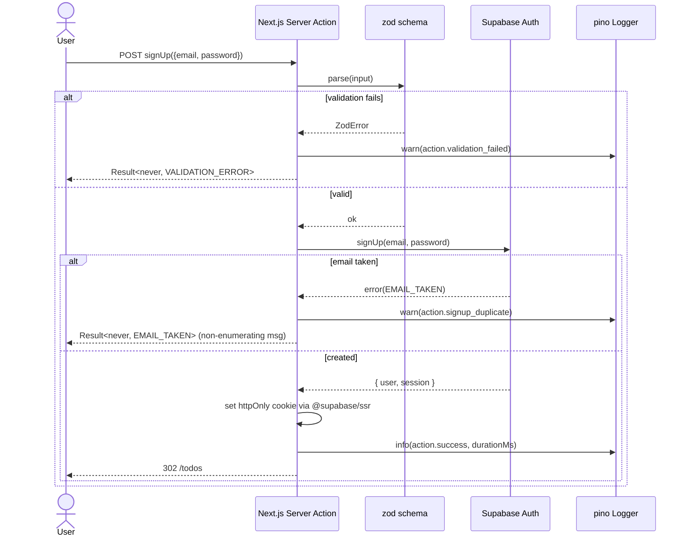
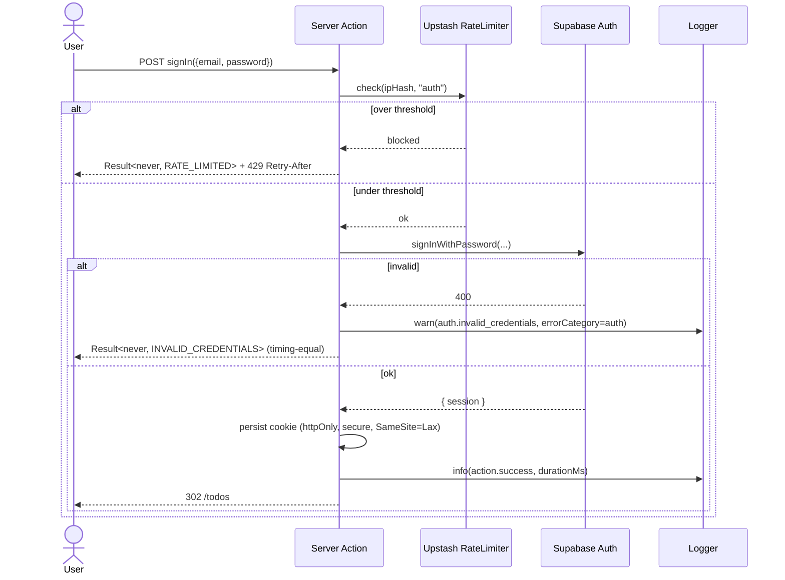
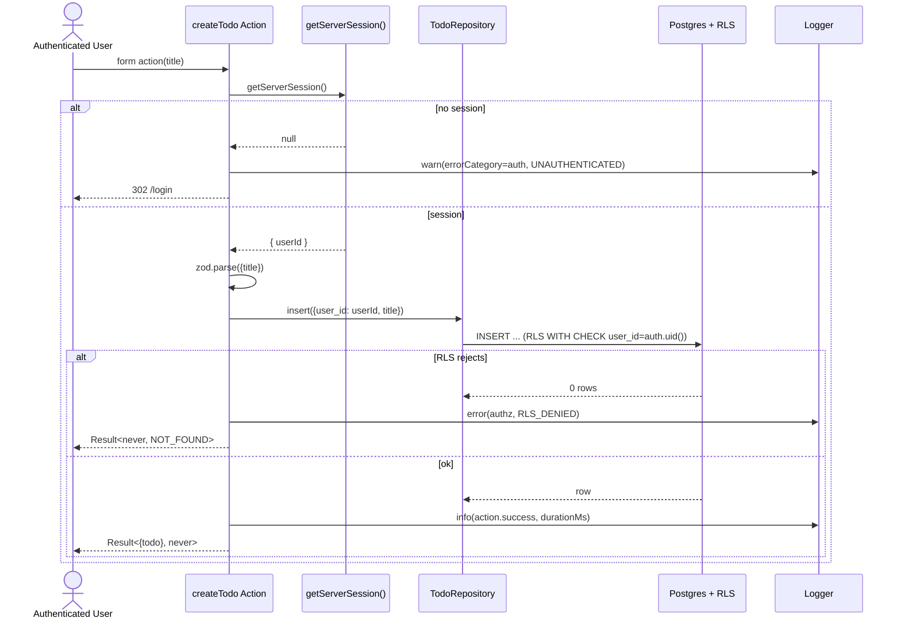
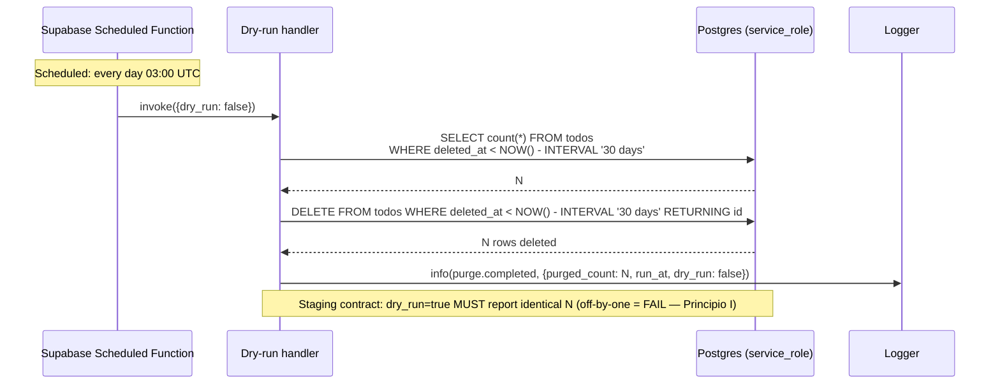
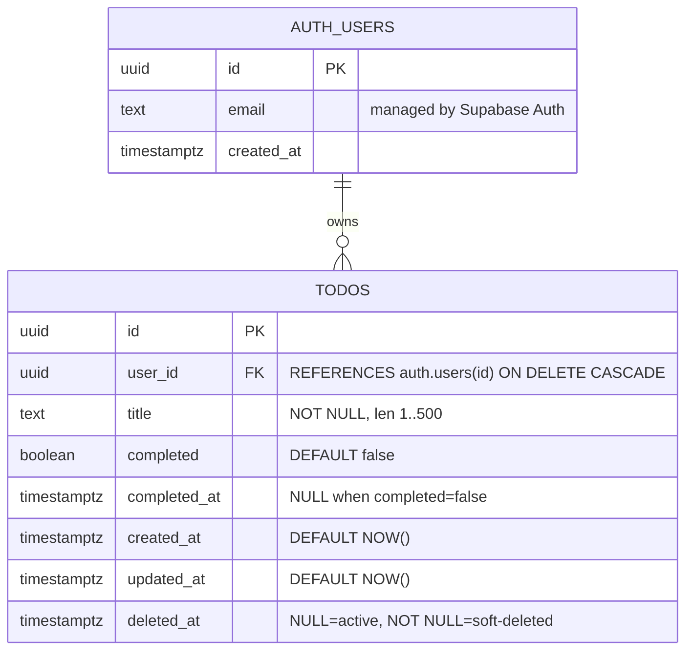
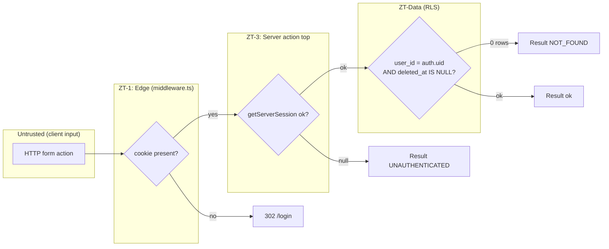

# Design: Personal Todo Management with User Authentication

**Change name**: todo-management
**Phase**: sdd-design
**Date**: 2026-05-21
**Artifact store**: openspec
**Upstream**: `proposal.md` + `specs/{auth,todos,observability}.md`
**Run purpose**: T1.9 — empirical comparison `sdd-*` vs `speckit-*`

---

## 1. Architecture Overview (A20 Hexagonal)

The system is structured as a **hexagonal monolith** running on Vercel's serverless runtime. The domain layer is the conceptual core; all I/O (Supabase, Next.js, pino, Upstash) lives in adapters around it. Dependency direction points **inward only** — `domain/` has zero infrastructure imports, validated by a deterministic CI grep (Principio I).

### C4-style component diagram

```mermaid
flowchart TB
    subgraph Client["Browser (React Server Components + Forms)"]
        UI[app/(app)/todos/page.tsx]
        Login[app/(auth)/login/page.tsx]
    end

    subgraph Edge["Next.js Edge Middleware"]
        MW[middleware.ts<br/>auth redirect ZT-1]
    end

    subgraph Server["Vercel Serverless (Next 15 RSC)"]
        subgraph App["adapters/next (driving)"]
            SA[Server Actions<br/>Result&lt;T,E&gt;]
        end
        subgraph Ports["ports (interfaces)"]
            TP[TodoRepository]
            AP[AuthPort]
            LP[Logger]
            RP[RateLimiter]
        end
        subgraph Domain["domain (pure)"]
            TE[Todo Entity]
            AE[AuthIdentity]
            INV[Invariants + Result&lt;T,E&gt;]
        end
        subgraph Adapters["adapters/supabase + lib (driven)"]
            SR[SupabaseTodoRepository]
            SA2[SupabaseAuthAdapter]
            PL[pino Logger + redaction]
            UR[Upstash RateLimiter]
            ENV[env.ts schema]
        end
    end

    subgraph External["External Services"]
        SB[(Supabase<br/>Postgres + Auth + RLS)]
        UP[(Upstash Redis)]
        VA[Vercel Analytics]
        SMTP[Custom SMTP<br/>Resend/SES]
    end

    UI -->|form action| SA
    Login -->|form action| SA
    MW -->|302 /login| Login
    SA --> Ports
    Ports -.implements.- Adapters
    SA --> Domain
    Adapters --> Domain
    SR --> SB
    SA2 --> SB
    UR --> UP
    PL --> VA
    SB --> SMTP
    ENV -.boot validation.- Server
```

**Key boundary rule**: arrows from `adapters/*` cross **into** `ports/*` (which the domain owns), never the reverse. `domain/` is the only module without outbound infra arrows.

---

## 2. Key Flows (sequence diagrams)

### 2.1 Sign-up (6 steps, 4 actors → diagram required)



### 2.2 Sign-in with email/password (5 steps, 5 actors → diagram required)



### 2.3 Create todo (ZT-3 + dual-layer authz)



### 2.4 Complete (toggle) todo — idempotent (A8)

```mermaid
sequenceDiagram
    actor U as User
    participant SA as toggleTodo Action
    participant AP as getServerSession
    participant TR as Repository
    participant DB as Postgres

    U->>SA: toggle(id)
    SA->>AP: getServerSession()
    AP-->>SA: { userId }
    SA->>TR: toggle(id, userId)
    TR->>DB: UPDATE todos SET completed = NOT completed,<br/>completed_at = CASE WHEN NOT completed THEN NOW() ELSE NULL END<br/>WHERE id=$1 AND user_id=$2 AND deleted_at IS NULL
    alt 0 rows (other user / deleted)
        DB-->>TR: 0
        SA-->>U: Result<never, NOT_FOUND>
    else 1 row
        DB-->>TR: row
        SA-->>U: Result<{todo}, never>
    end
    Note over SA,DB: Double-click → second UPDATE is the inverse; final state is consistent — no error returned (A8)
```

### 2.5 Soft-delete (reversible within 30d)

```mermaid
sequenceDiagram
    actor U as User
    participant SA as deleteTodo Action
    participant TR as Repository
    participant DB as Postgres

    U->>SA: delete(id)
    SA->>SA: getServerSession() → userId
    SA->>TR: softDelete(id, userId)
    TR->>DB: UPDATE todos SET deleted_at=NOW()<br/>WHERE id=$1 AND user_id=$2 AND deleted_at IS NULL
    alt already deleted (idempotent)
        DB-->>TR: 0 rows
        SA-->>U: Result<{id}, never> (treat as success, A8)
    else success
        DB-->>TR: 1 row
        SA-->>U: Result<{id}, never>
    end
    Note over TR,DB: Row remains physically present; recoverable for 30d window via admin script (R-5)
```

### 2.6 30-day purge cron (correctiva is upstream, this is finalization)



---

## 3. Data Model

### 3.1 Entity-relationship



### 3.2 Tables

| Table | Owner | Purpose | Lifecycle |
|-------|-------|---------|-----------|
| `auth.users` | Supabase Auth (managed) | Identity, email, hashed password, JWT subject | Hard-delete on account erasure (deferred v2 — Assumption #4) |
| `public.todos` | App | User-owned items | Soft-delete `deleted_at`; purged at 30d via cron |
| `public.todo_events` | App (DEFERRED v1.1) | Append-only audit (create/update/complete/delete) | Not in v1 — proposal Assumption #5; pino logs cover A6 minimally |
| `public.auth_events` | App (DEFERRED v1.1) | Sign-in / sign-out audit | Same as above |

> Audit tables (`todo_events`, `auth_events`) are explicitly **out of scope for v1**. Design phase concurs with proposal Assumption #5: pino retention + Vercel log drains satisfy A6 minimally. If A6 becomes critical, ADR-D7 below documents the upgrade path.

### 3.3 Columns & Constraints — `public.todos`

```sql
CREATE TABLE public.todos (
  id            uuid PRIMARY KEY DEFAULT gen_random_uuid(),
  user_id       uuid NOT NULL REFERENCES auth.users(id) ON DELETE CASCADE,
  title         text NOT NULL CHECK (char_length(btrim(title)) BETWEEN 1 AND 500),
  completed     boolean NOT NULL DEFAULT false,
  completed_at  timestamptz NULL,
  created_at    timestamptz NOT NULL DEFAULT now(),
  updated_at    timestamptz NOT NULL DEFAULT now(),
  deleted_at    timestamptz NULL,
  CHECK ((completed = true AND completed_at IS NOT NULL)
      OR (completed = false AND completed_at IS NULL))
);

CREATE INDEX todos_user_active_idx
  ON public.todos (user_id, created_at DESC)
  WHERE deleted_at IS NULL;          -- hot path: listTodos

CREATE INDEX todos_purge_idx
  ON public.todos (deleted_at)
  WHERE deleted_at IS NOT NULL;       -- cold path: 30d purge

CREATE TRIGGER todos_updated_at
  BEFORE UPDATE ON public.todos
  FOR EACH ROW EXECUTE FUNCTION moddatetime(updated_at);
```

### 3.4 RLS Policies (see §8 for full SQL)

| Op | Predicate |
|----|-----------|
| SELECT | `user_id = auth.uid() AND deleted_at IS NULL` |
| INSERT | WITH CHECK `user_id = auth.uid()` |
| UPDATE | USING `user_id = auth.uid() AND deleted_at IS NULL` (title, toggle, soft-delete) |
| DELETE | None for `authenticated` role — hard delete only via `service_role` (purge cron) |

### 3.5 Timezone Handling (R-6)

- **Storage**: all timestamps `timestamptz` → Postgres stores UTC internally regardless of session TZ.
- **Server actions**: read/write UTC; never convert.
- **Presentation only**: `Intl.DateTimeFormat` in React component with user's browser TZ.
- **CI gate**: lint rule forbids `new Date().toString()` in `domain/` or `adapters/supabase/` (only `toISOString()` allowed).

---

## 4. 3-Capas Mapping (Principio II)

| Operation | Preventiva (compile/schema) | Verificable (runtime/RLS/test) | Correctiva (auto-fix) |
|-----------|------------------------------|---------------------------------|------------------------|
| **Sign-up** | zod email + min-len; tsc strict; `env.ts` boot validation refuses missing SMTP config | `getServerSession()` after creation; Supabase uniqueness; rate-limit gate; ADV-A1 test | Non-enumerating error msg auto-collapses "email taken" vs "invalid" — no LLM choice |
| **Sign-in** | zod schema; tsc strict | Rate limit (Upstash); Supabase Auth verify; ADV-A2/A3 tests | Timing-equal error response (deterministic, not LLM) |
| **Session extract** | TypeScript `Session` brand type | `getServerSession()` ZT-3 gate; ADV-A2 forged JWT test | Middleware **auto-redirects** to `/login` (deterministic, not LLM) |
| **Create todo** | zod title len 1..500; TS `UserId` brand | Server-side `userId` from session (never client); RLS WITH CHECK; ADV-T1 test | Trim leading/trailing whitespace on title (deterministic auto-fix > rejecting input) |
| **List todos** | TS `Todo[]` return type | RLS SELECT + app-layer filter (dual gate); LIMIT 200 at DB | Empty-state UI is its own correction (no error) |
| **Update title** | zod len 1..500 | RLS USING + ownership check; 0-rows → NOT_FOUND | Trim whitespace deterministically |
| **Toggle complete** | TS bool | RLS USING; row count check; ADV-T2 test | **Idempotent** UPDATE: double-click collapses to same state (A8) — no LLM judgement |
| **Soft-delete** | TS `TodoId` brand | RLS USING; 0 rows = `NOT_FOUND` | **Recoverable for 30d** (the soft-delete itself is the corrective layer for accidental deletes — R-5) |
| **Purge cron** | TS interval literal | Dry-run reports exact count = live run; ADV-T6 race test | Idempotent: re-running finds 0 eligible rows; no double-delete |
| **PII redaction** | pino `redact.paths` config; eslint forbids `console.*` outside `lib/logger.ts` | CI grep on log fixture; ADV-O1/O4 tests | Pino serializer-layer redaction is the auto-fix path — applied uniformly, not per call site |

**Anti-pattern explicitly avoided**: the LLM never "decides" whether to redact, whether a request is authenticated, or whether a row belongs to the user. Each is a deterministic gate (Principio I + IV).

---

## 5. Hexagonal Architecture (A20)

### 5.1 Module map

```
src/
├── domain/                     ← pure, zero infra imports
│   ├── todo.ts                 ← Todo entity, TodoId brand, invariants
│   ├── auth.ts                 ← AuthIdentity, UserId brand
│   └── result.ts               ← Result<T, E> tagged union (A14)
├── ports/                      ← interfaces the domain depends on
│   ├── todo-repository.ts      ← TodoRepository interface
│   ├── auth-port.ts            ← AuthPort (session + signIn/Out/Up)
│   ├── logger-port.ts          ← Logger interface (A20: domain never imports pino)
│   └── rate-limiter-port.ts    ← RateLimiter interface
├── adapters/
│   ├── supabase/
│   │   ├── client.ts           ← createServerClient / createBrowserClient
│   │   ├── todo-repository.ts  ← implements ports/todo-repository
│   │   └── auth-adapter.ts     ← implements ports/auth-port
│   ├── upstash/
│   │   └── rate-limiter.ts     ← implements ports/rate-limiter-port
│   └── next/
│       └── actions/            ← server actions (driving adapter)
│           ├── auth/*.ts
│           └── todos/*.ts
├── lib/
│   ├── logger.ts               ← pino instance + redaction config (implements logger-port)
│   ├── env.ts                  ← zod schema for env vars; boot validation
│   └── result-helpers.ts       ← Ok(), Err() constructors
└── app/                        ← Next.js routes; thin glue
    ├── (auth)/login/page.tsx
    ├── (app)/todos/page.tsx
    ├── layout.tsx
    └── middleware.ts
```

### 5.2 Dependency direction rule

```
app ──→ adapters/next ──→ ports ←── adapters/supabase
                            ↑
                          domain  (depends on NOTHING)
```

Deterministic CI gate (Principio I):
```
rg "supabase|pino|@upstash|next/" src/domain/   →  MUST be 0 matches
rg "supabase|pino|@upstash|next/" src/ports/    →  MUST be 0 matches
```

### 5.3 Port interfaces (Result-shaped)

```ts
// ports/todo-repository.ts
export interface TodoRepository {
  insert(input: { userId: UserId; title: string }): Promise<Result<Todo, RepoError>>;
  listActiveByUser(userId: UserId, limit: number): Promise<Result<Todo[], RepoError>>;
  updateTitle(id: TodoId, userId: UserId, title: string): Promise<Result<Todo, RepoError>>;
  toggle(id: TodoId, userId: UserId): Promise<Result<Todo, RepoError>>;
  softDelete(id: TodoId, userId: UserId): Promise<Result<{ id: TodoId }, RepoError>>;
}

// ports/auth-port.ts
export interface AuthPort {
  getServerSession(): Promise<{ userId: UserId } | null>;
  signInPassword(email: string, pw: string): Promise<Result<Session, AuthError>>;
  signUp(email: string, pw: string): Promise<Result<Session, AuthError>>;
  signInMagicLink(email: string): Promise<Result<{ sent: true }, AuthError>>;
  signOut(): Promise<Result<void, never>>;
}
```

---

## 6. Observability Boundaries (A21)

### 6.1 Trace boundaries (logical spans, even without OTel)

```
[middleware]            ← redirect + ipHash
   └─ [server action]   ← action.start / action.success | action.error
         ├─ [port:auth]
         ├─ [port:todo-repo]
         └─ [port:rate-limiter]
   └─ [cron:purge]      ← purge.start / purge.completed
```

Every action and adapter call emits one structured log per span boundary with `{ action, durationMs, errorCategory, userId: "<REDACTED>" }`.

### 6.2 Log schema (pino base)

```json
{
  "level": "info | warn | error | fatal",
  "time": 1716326400000,
  "service": "todo-app",
  "msg": "action.success | action.validation_failed | action.infra_error | purge.completed",
  "context": {
    "action": "createTodo | toggleTodo | ...",
    "durationMs": 42,
    "errorCategory": "auth | authz | domain | infra",
    "userId": "<REDACTED>",
    "email": "<REDACTED>"
  }
}
```

### 6.3 Redaction rules (pino serializer level, not per-call)

```ts
// lib/logger.ts
pino({
  base: { service: "todo-app" },
  redact: {
    paths: ["context.email", "context.user.email", "*.email", "context.userId", "*.password"],
    censor: "<REDACTED>",
    remove: false
  },
  ...
});
```

CI gate (Principio I): `rg -i "email|@[a-z]" tests/fixtures/log-output.log` MUST return 0 matches → boolean pass/fail.

### 6.4 Error category routing

| `errorCategory` | Log level | Examples |
|-----------------|-----------|----------|
| `auth` | `warn` | UNAUTHENTICATED, INVALID_CREDENTIALS |
| `authz` | `warn` | NOT_FOUND from cross-tenant attempt, RLS_DENIED |
| `domain` | `warn` | VALIDATION_ERROR |
| `infra` | `error` (msg only — debug for stack) | DB_ERROR, RATE_LIMITER_DOWN |

---

## 7. Secrets (A22)

| Secret | Where it lives | Who reads | Boot validation | Rotation trigger |
|--------|----------------|-----------|-----------------|-------------------|
| `SUPABASE_URL` | Vercel env (public-encoded as `NEXT_PUBLIC_SUPABASE_URL`) | Browser + Server | `env.ts` zod | Region change |
| `SUPABASE_ANON_KEY` | Vercel env, `NEXT_PUBLIC_*` | Browser + Server | `env.ts` zod | RLS audit failure |
| `SUPABASE_SERVICE_ROLE_KEY` | Vercel env, **server-only** | Server actions + purge cron only | `env.ts` schema rejects if imported from `app/**/*client*` | Quarterly + on incident |
| `UPSTASH_REDIS_REST_URL` | Vercel env, server-only | Rate limiter | `env.ts` | Provider rotation |
| `UPSTASH_REDIS_REST_TOKEN` | Vercel env, server-only | Rate limiter | `env.ts` | Provider rotation |
| `SMTP_*` (Resend/SES) | Supabase Auth dashboard (not Vercel) | Supabase Auth only | Out-of-band check pre-deploy | SMTP provider switch |

**Determinism rules** (Principio I, Principio IV):
- `env.ts` runs at boot and **throws** on missing/invalid keys — no LLM judgement on whether to start.
- `eslint` rule forbids `process.env.SUPABASE_SERVICE_ROLE_KEY` outside `src/adapters/supabase/` and `supabase/functions/`.
- `.env.example` is committed with placeholder values; `.env*` (without `.example`) is gitignored.
- Rotation of `SERVICE_ROLE_KEY` is **mandatory** on any rollback caused by a security incident (proposal Rollback §4).

---

## 8. Data Lifecycle (A24)

### 8.1 Retention per table

| Table | Active rows | Soft-delete window | Hard-delete trigger | Audit |
|-------|-------------|--------------------|--------------------|-------|
| `auth.users` | Indefinite while signed up | None (account-delete is the only path, deferred v2) | Right-to-erasure (deferred, Assumption #4) | Supabase Auth internal |
| `public.todos` | Indefinite while `deleted_at IS NULL` | 30 days from `deleted_at` | `purge-deleted` cron @ 03:00 UTC daily | pino log of `{purged_count, run_at}` |
| `public.todo_events` (deferred v1.1) | Append-only | N/A — `INSERT`-only RLS | Never (until retention policy added) | self |

### 8.2 Soft-delete semantics

- A "deleted" todo has `deleted_at IS NOT NULL` AND remains physically present until purge.
- **Every** user-facing query MUST include `deleted_at IS NULL` (enforced twice: RLS SELECT predicate + app-layer Repository).
- Soft-delete on an already-soft-deleted row is **idempotent**: first timestamp preserved, no error (A8 + Spec §Soft-Delete Scenario 2).

### 8.3 Purge cron (Supabase Edge Function)

- **Schedule**: daily 03:00 UTC.
- **Predicate**: `deleted_at < NOW() - INTERVAL '30 days'`.
- **Modes**: `{dry_run: true}` reports count without deleting; `{dry_run: false}` (default scheduled) performs hard-delete with `RETURNING id` for log evidence.
- **Determinism contract** (Principio I): on a seeded staging DB, dry-run count MUST equal live-run count. Off-by-one is a FAIL gate.
- **Idempotency** (A8): re-running within the same hour finds 0 eligible rows; no double-delete corruption.
- **Concurrent runs** (A13 / ADV-T6): protected by Supabase Function's at-most-one-running-instance guarantee; if violated, both runs observe identical predicates → no double-counting.

### 8.4 Audit trail (minimal v1)

Pino logs are the audit trail for v1. Retention is whatever Vercel log drain is configured (default 24h on Hobby, 7d on Pro). Upgrade path (ADR-D7): if A6 (Append-Only) is judged critical for compliance, introduce `todo_events` + `auth_events` tables with `INSERT`-only RLS.

---

## 9. Authorization (A25)

### 9.1 RLS Policies — full SQL (`supabase/migrations/0002_rls.sql`)

```sql
ALTER TABLE public.todos ENABLE ROW LEVEL SECURITY;

-- 1) SELECT: own + active only
CREATE POLICY "todos_owner_select" ON public.todos
  FOR SELECT
  TO authenticated
  USING (user_id = auth.uid() AND deleted_at IS NULL);

-- 2) INSERT: own only (user_id forced server-side anyway)
CREATE POLICY "todos_owner_insert" ON public.todos
  FOR INSERT
  TO authenticated
  WITH CHECK (user_id = auth.uid());

-- 3) UPDATE: own + active (covers title, toggle, soft-delete)
CREATE POLICY "todos_owner_update" ON public.todos
  FOR UPDATE
  TO authenticated
  USING (user_id = auth.uid() AND deleted_at IS NULL)
  WITH CHECK (user_id = auth.uid());

-- 4) DELETE: forbidden for authenticated role; only service_role purges
-- (no policy = deny by default with RLS enabled)

-- 5) anon role: full deny (no policy + RLS enabled = 0 rows)
REVOKE ALL ON public.todos FROM anon;
```

### 9.2 Server-side ownership check pattern (defense in depth)

Every mutating server action follows this skeleton:

```ts
export async function toggleTodo(input: { id: string }): Promise<Result<{ todo: Todo }, ActionError>> {
  const start = Date.now();
  const session = await auth.getServerSession();              // ZT-3 gate
  if (!session) return Err({ code: "UNAUTHENTICATED" });

  const parsed = ToggleInput.safeParse(input);                // zod
  if (!parsed.success) return Err({ code: "VALIDATION_ERROR" });

  const r = await todoRepo.toggle(parsed.data.id, session.userId); // RLS gate
  logger.info({ action: "toggleTodo", durationMs: Date.now() - start }, "action.success");
  return r;
}
```

Two independent layers — **RLS at DB** and **explicit `userId` from session at app**. Neither alone is sufficient.

### 9.3 ZT-3 boundary diagram



**Three gates**, each fail-closed: bypassing one still leaves two. ADV-A4 (client-supplied `user_id`) is neutralized at ZT-3 (server uses session, ignores payload). ADV-T2 (cross-tenant attempt) is neutralized at RLS regardless of ZT-3.

---

## 10. Reversibility (R-5)

| Destructive operation | Reversal mechanism | Reversal window | Residual risk |
|------------------------|---------------------|------------------|----------------|
| `deleteTodo` (soft-delete) | `UPDATE todos SET deleted_at = NULL WHERE id=$1 AND user_id=$2` (admin script — no user UI in v1) | 30 days from `deleted_at` | None — physical row present |
| Purge cron hard-delete | Restore from Supabase PITR (Point-in-Time Recovery) on Pro tier | 7 days (Pro) | Hobby tier = no PITR → **hard floor** at 30d + 0 |
| `updateTodoTitle` | Not reversible (no event store v1) | Never (deferred to v1.1 with `todo_events`) | Loss of prior title — mitigated by audit table in v1.1 |
| `toggleTodo` | Re-toggle (idempotent inverse) | Always | None |
| Account sign-out | Sign back in | Always | None |
| Account deletion (deferred v2) | Restore from PITR + Supabase Auth admin restore | 7 days (Pro) | None within window |
| RLS policy migration | `0002_rls.down.sql` reverse migration | Until next schema change | Brief unprotected window between drop and re-create — apply via transaction |
| Deploy rollback | Vercel "Promote previous deployment" | Indefinite (per Vercel retention) | DB schema is not rolled back — schema migrations are forward-fix |

**Hard floor** (per proposal §Rollback note): operations older than `30 days + Vercel PITR window` are **not recoverable**. This is the unrecoverable boundary documented to users implicitly via the soft-delete window.

---

## 11. Architecture Decision Records (ADRs)

### ADR-D1: Server Actions as the sole data-access surface

**Choice**: All mutations + reads go through Next 15 Server Actions. No `/api/*` route handlers in v1.
**Alternatives**: REST API in `app/api/`; tRPC; GraphQL.
**Rationale**: Server Actions colocate ZT-3 with the call site, eliminate the marshalling boundary, and produce simpler error categorization. v1 has no external API consumers (mobile/3rd-party deferred v2). When external API is needed, REST handlers can be added without refactoring domain or ports.
**Tradeoff**: Coupling to Next.js framework; mitigated because adapters/next is the only Next-aware layer (A20).
**Status**: Accepted.

### ADR-D2: Dual-layer authorization (RLS + server-side check)

**Choice**: Every read/mutate is filtered at BOTH the DB (RLS) and the server-action (`userId` from session). Both must agree.
**Alternatives**: RLS only (simpler); server-side only (no defense in depth).
**Rationale**: Single-point auth is fragile. A bug in either layer would leak data. With dual gates, ADV-T1 (forged `user_id` in payload) is caught at ZT-3, ADV-T2 (cross-tenant ID guess) at RLS. The cost is one extra parameter on each repository call — acceptable.
**Tradeoff**: Slight code duplication; mitigated by making `userId` an explicit port-method parameter (TypeScript brand type prevents passing the wrong value).
**Status**: Accepted (anchors A5, A12 ZT-3, A25).

### ADR-D3: Soft-delete + 30-day cron purge over hard-delete

**Choice**: User "delete" sets `deleted_at`; physical removal happens 30 days later by cron.
**Alternatives**: Immediate hard-delete; trash-bin UI; never-delete.
**Rationale**: 30-day window is the cheapest realistic A24 corrective layer — recovers user mistakes without UI complexity. The cron is idempotent and dry-run-verifiable (Principio I). PITR backstops the cron itself.
**Tradeoff**: Extra disk + index maintenance for deleted rows; partial index `WHERE deleted_at IS NOT NULL` mitigates cost.
**Status**: Accepted. Re-evaluate when row count > 1M (likely never at scale=1).

### ADR-D4: Hexagonal layout with `Result<T, E>` end-to-end

**Choice**: `domain/` is pure; `ports/` define interfaces; `adapters/*` implement. Every server action returns `Result<T, E>` — no thrown exceptions across the action boundary.
**Alternatives**: Plain functional layout; throw exceptions; `Either` monad library.
**Rationale**: `Result` makes the unhappy path a first-class type (A14 — explicit failure); exhaustive switch on the tag forces every caller to handle errors. Hexagonal makes the domain testable without infra and keeps Supabase swappable. The constraint earns its keep when the spec phase enumerates non-happy scenarios first.
**Tradeoff**: More boilerplate vs throwing; mitigated by `Ok()` / `Err()` helpers and an eslint rule (planned) requiring `Result<_,_>` on exported actions.
**Status**: Accepted (anchors A14, A20).

### ADR-D5: Pino + serializer-layer redaction (not OTel in v1)

**Choice**: Single `pino` instance configured with `redact.paths`. No OpenTelemetry in v1.
**Alternatives**: OTel + Honeycomb/Datadog; Winston; custom logger.
**Rationale**: v1 has one service and no distributed tracing surface. Pino with serializer-layer redaction makes PII-leakage a **structural impossibility** (not a per-call discipline) — Principio IV (auto-fix > finding). OTel pays off when there are 2+ services or external propagation; not yet.
**Tradeoff**: No distributed tracing if/when v1.1 adds a second service; explicit upgrade path documented (introduce OTel SDK + replace pino transports).
**Status**: Accepted. Upgrade to OTel when adding any out-of-process worker.

### ADR-D6: Upstash Redis for rate limiting (auth endpoints only)

**Choice**: Auth server actions (sign-in, sign-up, magic-link) are rate-limited via Upstash Redis. CRUD endpoints are not rate-limited in v1 (single-user scope).
**Alternatives**: In-memory limiter (broken on serverless); Vercel KV; Cloudflare Turnstile.
**Rationale**: Serverless functions cannot share memory → in-memory rate limiter is unsafe. Upstash has a free tier sufficient for v1, supports `@upstash/ratelimit` SDK, and aligns with A16. CRUD rate-limiting deferred because a single user cannot meaningfully DoS themselves.
**Tradeoff**: One more external dependency + two secrets; isolated behind `ports/rate-limiter-port.ts` so swappable.
**Status**: Accepted (proposal Assumption #2).

### ADR-D7: Audit event tables deferred to v1.1 (pino logs cover v1)

**Choice**: `todo_events` and `auth_events` are **out of scope** for v1. Pino structured logs (with Vercel log drain retention) satisfy A6 minimally.
**Alternatives**: Ship audit tables in v1; CDC stream via Supabase Realtime; external SIEM.
**Rationale**: Audit tables add 2 migrations + RLS + an INSERT trigger per mutation — a real cost. For v1's scope (canonical Tier-1 @ scale=1, no compliance requirement), pino logs are sufficient. ADV-O scenarios are covered by log fixtures. If GDPR / SOC2 enters scope, ADR-D7 documents the migration path.
**Tradeoff**: Less granular audit in v1; `updateTodoTitle` history is unrecoverable (called out in §10 Reversibility).
**Status**: Accepted (proposal Assumption #5). Re-evaluate before any EU launch (Assumption #4).

### ADR-D8: All timestamps in UTC (timestamptz), TZ conversion in browser only (R-6)

**Choice**: Postgres `timestamptz` everywhere; server returns ISO-8601 UTC; React component formats with user's browser TZ via `Intl.DateTimeFormat`.
**Alternatives**: Store local TZ; server-side TZ conversion; offset columns.
**Rationale**: UTC-only storage is R-6's whole point — comparisons, sorts, and cron predicates are all unambiguous. TZ is a presentation concern, lives at the leaf. A CI lint forbids `Date.toString()` / `Date.toLocaleString()` outside React components.
**Tradeoff**: One discipline (no `Date.toString()` in server code); mitigated by lint rule.
**Status**: Accepted.

---

## Open Questions (none blocking)

- [ ] Should `updateTodoTitle` capture prior title in pino at `debug` level to provide an informal undo trail before `todo_events` lands in v1.1? (Spec phase has not required it; design defers.)
- [ ] Should the 200-item cap (Assumption #6) be enforced via `LIMIT 201` to detect "user actually has > 200" and surface the overflow banner accurately? Design proposes `LIMIT 201` and returns 200 + `{ capped: total >= 201 }` to the UI.

---

## Next Phase

Ready for **`sdd-tasks`** — both `spec` and `design` artifacts are now lockable inputs. Tasks phase MUST pair every feature task with an adversarial test task (proposal Polinización candidate #3).
